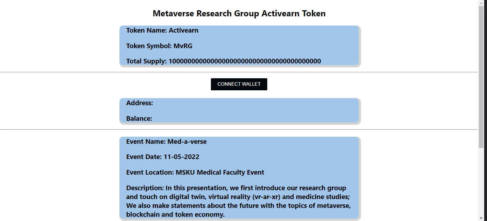
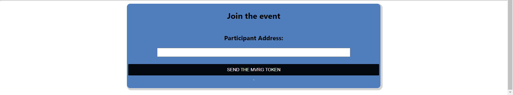

# Activearn

This project is based on handling the problem of low attendance at events using a decentralized solution.

    
Table of Contents

    <ol>
        <li><a href="#activearn">Activearn</a></li>
        <li><a href="#project-description">Project Description</a></li>
        <li><a href="#team-members">Team Members</a></li>
        <li><a href="#system-model">System Model</a></li>
        <li><a href="#implementation">Implementation</a></li>
        <li><a href="#design-screenshot">Design Screenshot</a></li>
        <li><a href="#technologies-used">Technologies Used</a></li>
        <li><a href="#introduction-video">Introduction Video</a></li>
        <li><a href="#touch">Touch</a></li>
    </ol>

## 🖥 Project Description

Research groups depend on their members and their activity to continue their activities. It is
necessary to encourage students and academics to become members, to follow the participation
of members in activities and to encourage them to be more active. While doing this, it is necessary to attach importance to the privacy of personal data and to build trust between the member and the research group. In today’s membership practices, identity data is stored in a database and users assume that their data is confidential. Due to increasing security breaches and legal requirements, the privacy of personal data should be given importance in the systems to be developed. Gamification methods should also be used to provide motivation. There is a need for an effective and reliable system that can provide this.

## 👨‍💻👩‍💻👨‍💻 Team Members

<table>
    <tr>
        <td align="center"><a href="https://github.com/MrBuluc"> <b>Hakkıcan Bülüç</b></a>  <b>Smart Contract Developer</b></a> </a></td>
        <td align="center"><a href="https://github.com/helinkabak"> <b>Helin Aylin Kabak</b></a>  <b>React Developer</b></a> </a></td>
        <td align="center"><a href="https://github.com/huseyinnc"> <b>Hüseyin Çoban</b></a>  <b>React Developer</b></a> </a></td>
    </tr>
</table>

## 🌈 System Model

    

First of all, in order for our system to work properly, our users must have accounts in a
virtual wallet, for example MetaMask. Afterwards, our users will go to our free events and earn
MvRG Tokens and these tokens will be kept in their virtual wallets. If our users want to go to vip
events, MvRG Token will be read from their virtual wallets and then they will be able to enter
that event after spending the desired amount of tokens. And all these operations will be done
with a smartphone and qr.

## 🧑‍💻 Implementation

First of all, participants must have downloaded the MvRG mobile application to their smart phones. User goes to an event of MvRG. A qr is shown to attendees at the event. Participants
enter the event by scaning the displayed QR through the MvRG mobile application. After each
event, the person in charge of that event takes the virtual wallet addresses of the participants
and enters the website where he will send MvRG Tokens to the participants. On this website,
the name, symbol and total supply of the tokens that the participants of the event will receive
are displayed. At the same time, users can see their own addresses and the amount of MvRG
Tokens they own after connecting their virtual wallets to this website by entering this website.
At the same time, this website contains the current event’s name, date, location and a brief
description. The event attendant sends MvRG Tokens to the attendees by entering the addresses
of the attendees.

## 📷 Design Screenshot

&nbsp;&nbsp;&nbsp;&nbsp;

## 🛠 Technologies Used

<table style"float:right;">  
  <tr>  
    <td></td>
    <td></td>  
    <td></td>  
  </tr>  
  <tr>  
    <td></td>  
    <td></td>  
    <td></td>  
  </tr>  
  <tr>  
    <td></td>  
    <td> </td>  
    <td></td>  
  </tr> 
</table>

## 📽 Introduction Video

## 📱 Touch

    
<b> <samp> Contact Us </samp></b>

     
    <samp>
    <b><h2 style="color: #fc6203">HAKKICAN&nbsp; BÜLÜÇ</h2></b>  
     
        
     Projenin Linki: <a href="https://github.com/MrBuluc/mvrg-react">MvRG React</a>  
        
        
     LinkedIn: <a href="https://www.linkedin.com/in/hakkican-buluc/"> LinkedIn Hesabım</a>
     <b><h2 style="color: #fc6203">HELİN AYLİN&nbsp; KABAK</h2></b>
        
        
     LinkedIn: <a href="https://www.linkedin.com/in/helinkabak/"> LinkedIn Hesabım</a>
     <b><h2 style="color: #fc6203">HÜSEYİN&nbsp; ÇOBAN</h2></b>
        
        
     LinkedIn: <a href="https://www.linkedin.com/in/huseyin-coban/"> LinkedIn Hesabım</a>
    </samp>

